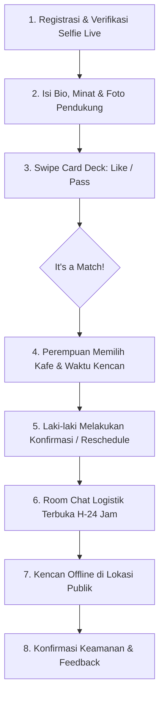

# 🌹 BlindDate — Real Dates, No Endless Chat

> **Aplikasi Web & PWA Blind Date Offline Berbasis Komunitas**  
> Mengatasi *dating app fatigue* dengan menghubungkan orang langsung ke pertemuan nyata yang aman, terverifikasi, dan anti-basa-basi.

---

## 📌 Daftar Isi
1. [Latar Belakang & Masalah](#-latar-belakang--masalah)
2. [Solusi & Keunggulan Produk (USP)](#-solusi--keunggulan-produk-usp)
3. [Fitur Utama & Alur Pengguna (User Flow)](#-fitur-utama--alur-pengguna-user-flow)
4. [Model Bisnis & Monetisasi](#-model-bisnis--monetisasi)
5. [Arsitektur Teknis & Tech Stack](#-arsitektur-teknis--tech-stack)
6. [Struktur Direktori Proyek](#-struktur-direktori-proyek)
7. [Roadmap Pengembangan (Milestones)](#-roadmap-pengembangan-milestones)
8. [Panduan Menjalankan Proyek (Getting Started)](#-panduan-menjalankan-proyek-getting-started)

---

## 💡 Latar Belakang & Masalah

Aplikasi kencan konvensional (seperti Tinder, Bumble, dsb.) saat ini banyak menuai kritik dan kelelahan pengguna (*dating app fatigue*) yang disebabkan oleh:
* **Endless Small Talk:** Terjebak dalam obrolan chat berhari-hari/berminggu-minggu tanpa pernah ada kepastian untuk bertemu.
* **Fenomena Ghosting:** Tingginya tingkat obrolan yang terputus sepihak sebelum sempat mengenal lebih jauh.
* **Catfishing & Akun Palsu:** Foto profil yang tidak sesuai dengan wajah asli atau menggunakan foto lama/orang lain.
* **Sindrom "Terserah Mau Ketemu di Mana":** Kebingungan dan rasa canggung dalam menentukan tempat kencan pertama, terutama bagi pihak perempuan yang mengkhawatirkan faktor keamanan.

---

## 🎯 Solusi & Keunggulan Produk (USP)

BlindDate hadir bukan sebagai aplikasi *chatting*, melainkan platform fasilitator kencan offline:

1. **Wajib Live Selfie (Anti-Catfishing):** Foto utama profil diambil langsung melalui kamera web/browser saat registrasi untuk memastikan wajah asli pengguna terkini.
2. **Kendali Tempat di Tangan Perempuan (*Women-First Venue Choice*):** Saat terjadi match, pihak perempuan yang menentukan nama kafe/restoran dan waktu kencan demi kenyamanan dan keamanan maksimal.
3. **Chat Minimalis Khusus Logistik:** Tidak ada ruang untuk *small talk* tanpa akhir. Chat hanya terbuka **24 jam sebelum kencan** untuk koordinasi teknis (pakaian, posisi meja) dan otomatis ditutup setelah kencan selesai.
4. **PWA Mobile-First (Tanpa Biaya App Store):** Dapat diakses dan dipasang (*Install to Home Screen*) di Android maupun iOS secara gratis tanpa ketergantungan pada biaya tahunan developer app store.
5. **Paket Berlangganan Mikro (QRIS):** Harga terjangkau untuk mahasiswa & umum (Rp 5.000/minggu & Rp 20.000/bulan).

---

## 🚀 Fitur Utama & Alur Pengguna (User Flow)



### Rincian Alur Logika:
* **Onboarding & Verifikasi:**
  Pengguna mengisi data diri (Nama, Email, WhatsApp, Gender, Tanggal Lahir 18+). Sistem meminta akses kamera untuk mengambil 1 selfie live sebagai foto utama.
* **Mekanisme Penjodohan (Swipe Deck):**
  Pengguna melakukan *swipe right* (like) atau *swipe left* (pass) berdasarkan foto terverifikasi, bio, hobi, dan minat.
* **Undangan Kencan (*Date Invitation*):**
  Ketika kedua pihak saling like, perempuan mendapatkan formulir untuk mengisi nama tempat (Coffee Shop / Restoran publik) dan slot waktu. Undangan dikirim ke pihak laki-laki.
* **Konfirmasi & Reschedule:**
  Laki-laki memiliki batas waktu (misal 24 jam) untuk menekan **"Accept"** atau **"Ajukan Waktu Lain"** jika berhalangan.
* **Chat Khusus Hari-H:**
  Chat aktif H-24 jam sebelum janji temu dengan tombol cepat (*Quick Prompts*): *"Sudah sampai meja 4"*, *"Pakai kemeja hitam"*, dsb.

---

## 💰 Model Bisnis & Monetisasi

Aplikasi menggunakan pendekatan **Freemium Micro-Subscription** yang ramah kantong:

| Kategori | Pengguna Gratis (Free Tier) | Pengguna Berlangganan (Pro Pass) |
| :--- | :--- | :--- |
| **Harga** | Rp 0 | **Rp 5.000 / minggu** atau **Rp 20.000 / bulan** |
| **Batas Swipe Harian** | 10 – 15 swipe per hari | **Unlimited Swipe** |
| **Akses Kencan** | 1x Kencan Pertama Gratis | **Bebas Mengatur Kencan Tanpa Batas** |
| **Lihat Siapa yang Menyukai** | Foto diburamkan | **Bisa melihat daftar orang yang swipe right** |
| **Prioritas Match** | Standar | **Profil diprioritaskan di feed teratas** |

### Mekanisme Pembayaran (Dynamic QRIS)
* Menggunakan Payment Gateway lokal (**Midtrans / Tripay**).
* Sistem membuat QRIS Dinamis unik setiap kali pengguna checkout.
* Biaya transaksi sangat efisien (MDR QRIS 0.7% = hanya ~Rp 35 untuk transaksi Rp 5.000).
* Webhook otomatis mengaktifkan status `is_pro` dan memperpanjang masa aktif akun secara *real-time*.

---

## 🛠️ Arsitektur Teknis & Tech Stack

```
┌────────────────────────────────────────────────────────┐
│                   FRONTEND (Web PWA)                   │
│   Next.js 16 (App Router) + TypeScript + Tailwind CSS  │
│   Framer Motion (Gestures) + Lucide Icons + PWA Engine │
└──────────────────────────┬─────────────────────────────┘
                           │
┌──────────────────────────▼─────────────────────────────┐
│               BACKEND & SERVERLESS LOGIC               │
│   Next.js Server Actions & Route Handlers (Vercel)     │
└──────┬───────────────────┬───────────────────┬─────────┘
       │                   │                   │
┌──────▼──────┐     ┌──────▼──────┐     ┌──────▼─────────┐
│   DATABASE  │     │   STORAGE   │     │  EXTERNAL API  │
│  Supabase   │     │  Supabase / │     │ • Midtrans     │
│ PostgreSQL  │     │ Cloudinary  │     │ • Fonnte (WA)  │
│  & Realtime │     │ (Live Photo)│     │ • Resend Email │
└─────────────┘     └─────────────┘     └────────────────┘
```

* **Frontend:** Next.js (React 19), TypeScript, Tailwind CSS v4, Framer Motion (untuk gesture animasi swipe).
* **Backend:** Next.js Serverless API Routes / Server Actions.
* **Database & Autentikasi:** Supabase (PostgreSQL) dengan Row Level Security (RLS) & Supabase Realtime (Websocket).
* **Penyimpanan Foto (Object Storage):** Supabase Storage / Cloudinary (auto-compression & smart cropping).
* **Payment Gateway:** Midtrans / Tripay (Dynamic QRIS & Webhook Handler).
* **Notifikasi:** Fonnte WhatsApp Gateway (notifikasi undangan kencan otomatis) & Resend (Email).
* **Hosting & Infrastruktur:** Vercel (Deploy CI/CD, SSL otomatis, Edge CDN).

---

## 📁 Struktur Direktori Proyek

```
blind-date-app/
├── public/                     # Asset statis, favicon, manifest PWA
├── src/
│   ├── app/
│   │   ├── (auth)/             # Route Group: Autentikasi
│   │   │   ├── layout.tsx      # Auth Layout wrapper (MobileContainer)
│   │   │   ├── login/page.tsx  # Halaman Login
│   │   │   └── signup/page.tsx # Halaman Registrasi (Gender & DOB 18+)
│   │   ├── (main)/             # Route Group: Fitur Utama (Swipe, Dates, Profile)
│   │   ├── api/                # Backend Serverless API & Webhooks
│   │   ├── globals.css         # Styling global, Glassmorphism, Tema Warna
│   │   ├── layout.tsx          # Root layout & Viewport Settings
│   │   └── page.tsx            # Welcome / Splash Screen
│   ├── components/
│   │   ├── auth/               # Komponen spesifik login & signup
│   │   ├── layout/             # MobileContainer & Navigation bars
│   │   ├── swipe/              # Komponen kartu swipe kencan & gesture
│   │   ├── date/               # Komponen undangan kencan & pemilihan kafe
│   │   └── ui/                 # Komponen atomik (Button, Input, Badge, Card)
│   ├── lib/
│   │   ├── utils.ts            # Helper function (clsx, twMerge)
│   │   └── constants.ts        # Konstanta tema & konfigurasi
│   └── types/
│       ├── auth.ts             # Type definition auth & user profile
│       └── date.ts             # Type definition kencan & undangan
├── package.json
└── tsconfig.json
```

---

## 🗺️ Roadmap Pengembangan (Milestones)

- [x] **Fase 1: Inisialisasi Fondasi & Desain Awal**
  - [x] Brainstorming model bisnis & alur kencan.
  - [x] Setup proyek Next.js, TypeScript, Tailwind CSS, dan Framer Motion.
  - [x] Implementasi MobileContainer (Responsive PWA frame).
  - [x] Implementasi UI Splash Screen, Halaman Login, dan Halaman Sign Up.

- [ ] **Fase 2: Onboarding & Verifikasi Kamera (Live Selfie)**
  - [ ] Pembuatan komponen akses kamera (`getUserMedia`) langsung di browser.
  - [ ] Alur pengambilan 1 foto selfie utama (wajib) + upload foto pendukung hobi/gaya hidup.
  - [ ] Pengisian profil minat, bio singkat, dan preferensi area kencan.

- [ ] **Fase 3: Core Deck Swipe Matching**
  - [ ] Implementasi interaksi kartu swipe (*gesture left = pass, right = like*).
  - [ ] Modal notifikasi saat terjadi *Mutual Match* ("It's a Match!").

- [ ] **Fase 4: Alur Undangan Kencan (Women-First Venue Picker)**
  - [ ] Antarmuka pemilihan kafe/restoran dan jadwal bagi pihak perempuan.
  - [ ] Kartu undangan digital & alur konfirmasi/reschedule bagi pihak laki-laki.

- [ ] **Fase 5: Chat Logistik Minimalis & Realtime Engine**
  - [ ] Room chat yang hanya aktif H-24 jam sebelum waktu kencan.
  - [ ] Integrasi Quick Prompts ("Sudah sampai", "Pakai baju hitam").

- [ ] **Fase 6: Integrasi QRIS Payment Gateway & Langganan Pro**
  - [ ] Integrasi Midtrans / Tripay Dynamic QRIS (Paket Rp 5.000 / Rp 20.000).
  - [ ] Webhook backend untuk update status keanggotaan otomatis.

- [ ] **Fase 7: Notifikasi WhatsApp & PWA Installability**
  - [ ] Integrasi Fonnte untuk trigger WA saat ada kencan masuk.
  - [ ] Service worker, manifest PWA, dan banner *"Add to Home Screen"*.

- [ ] **Fase 8: Peluncuran Terbatas (*Hyper-Local Launch*)**
  - [ ] Uji coba terbatas (*Alpha Test*) di 1 kampus / 1 komunitas kota tertentu.

---

## 💻 Panduan Menjalankan Proyek (Getting Started)

### Prasyarat:
* Node.js versi 18 ke atas (Direkomendasikan v20+)
* npm / yarn / pnpm

### Langkah Instalasi & Menjalankan:
1. **Clone repository & masuk ke direktori proyek:**
   ```bash
   cd blind-date-app
   ```

2. **Install dependensi:**
   ```bash
   npm install
   ```

3. **Jalankan server pengembangan lokal:**
   ```bash
   npm run dev
   ```

4. **Buka di browser:**
   * Landing Screen: [http://localhost:3000](http://localhost:3000)
   * Login: [http://localhost:3000/login](http://localhost:3000/login)
   * Sign Up: [http://localhost:3000/signup](http://localhost:3000/signup)

---

## 🔒 Kebijakan Keamanan & Privasi

1. **Anti-Catfishing:** Setiap pengguna diverifikasi dengan foto wajah live terkini.
2. **Tempat Publik Terbuka:** Seluruh kencan diarahkan di tempat umum (coffee shop/restoran ramai).
3. **Privasi Nomor:** Nomor WhatsApp tidak disebarkan ke pasangan kencan dan hanya digunakan oleh sistem untuk notifikasi jadwal kencan resmi.
